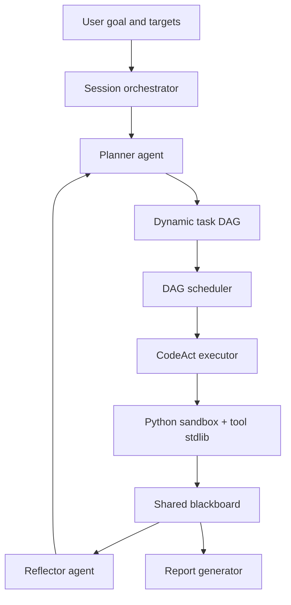

# Divine

> Multi-agent orchestration prototype for authorized security assessment workflows.

Divine is a research-oriented framework prototype for automated penetration-testing workflows. It uses an LLM-driven planner, a dynamic task DAG, role-aware CodeAct executors, and a shared blackboard to coordinate iterative reconnaissance, verification, reflection, replanning, and report generation.

The project is designed for CTFs, lab ranges, local targets, and explicitly authorized testing environments. It is not intended for unsanctioned public-target automation.

## Why Divine

Modern security testing is rarely a single prompt-response interaction. Useful automation needs state, task decomposition, evidence tracking, failure handling, and the ability to revise the plan as new observations appear.

Divine explores that loop as a concrete system:

- **Plan as a DAG**: tasks are represented as dependency-aware nodes instead of a flat checklist.
- **Share state through a blackboard**: hosts, ports, findings, credentials, reflections, and task traces are persisted in a common store.
- **Execute through CodeAct**: executors generate Python actions, observe results, write evidence, and converge with explicit completion markers.
- **Reflect and replan**: each round can feed structured observations back into the planner to evolve the task graph.
- **Route across providers**: OpenAI, Anthropic, Zhipu, MiniMax, and OpenAI-compatible endpoints can be selected through configuration.
- **Track cost and diagnostics**: token usage, estimated cost, retry behavior, and detailed debug logs are recorded for analysis.

## Architecture



### Core Components

| Component | Responsibility |
| --- | --- |
| `divine.session` | Main orchestration loop: planning, scheduling, execution, reflection, replanning, termination |
| `divine.dag` | Dependency-aware task graph and round scheduler |
| `divine.blackboard` | SQLite-backed shared state and audit log |
| `divine.agents` | Planner and reflector agents |
| `divine.codeact` | Code execution loop, sandbox, and task tool standard library |
| `divine.llm` | Provider routing, retries, cost calculation, and streaming support |
| `divine.prompts` | Jinja2 prompt templates for planning, execution, reflection, and termination |
| `divine.reporting` | HTML report generation from blackboard evidence |

## Installation

Divine requires Python 3.11 or newer.

```bash
git clone https://github.com/Hunt3rKun/Divine.git
cd Divine

python -m venv .venv
source .venv/bin/activate

pip install -e ".[dev]"
```

Run the test suite:

```bash
pytest -q
```

## Configuration

Start from the example file:

```bash
cp targets.yaml.example targets.yaml
```

Then edit `targets.yaml`:

```yaml
targets:
  - "http://127.0.0.1:8080"

goal: "在授权测试环境中完成目标识别、漏洞验证和报告生成。"

llm:
  providers:
    openai_compat:
      api_key: "${OPENAI_COMPAT_API_KEY}"
      base_url: "https://api.example.com/v1"

planner_model: "gpt-4o"
reflector_model: "gpt-4o"
executor_model: "gpt-4o"

max_rounds: 20
max_tasks: 50
concurrency: 1
code_execution_timeout: 60
log_level: "INFO"
```

`targets.yaml` is intentionally ignored by git because it may contain live targets and API keys.

## Usage

Run a Divine session:

```bash
divine engage --config targets.yaml
```

Show the installed version:

```bash
divine version
```

During a run, Divine will:

1. Build an initial task DAG from the goal and target scope.
2. Select dependency-ready tasks by priority.
3. Execute tasks through the CodeAct sandbox.
4. Write useful observations into the blackboard.
5. Reflect on recent results and update the plan when needed.
6. Stop when the goal is met, the graph reaches a terminal state, or configured limits are reached.

Debug logs are written to `divine_debug.log`.

## Tool Standard Library

Executors receive a constrained Python environment with helper functions:

| Function | Purpose |
| --- | --- |
| `run_command(cmd, timeout=60)` | Execute a shell command and capture output |
| `http_request(url, method="GET", ...)` | Send basic HTTP requests |
| `bb_read(section, key=None)` | Read from the shared blackboard |
| `bb_write(section, key, value, source="")` | Persist findings, hosts, ports, credentials, or reflections |
| `parse_nmap(output)` | Extract structured service data from nmap-style output |
| `parse_url(url)` | Parse scheme, host, port, path, and query |
| `b64encode(data)` / `b64decode(data)` | Encode or decode base64 strings |

## Development

Recommended workflow:

```bash
source .venv/bin/activate
pytest -q
```

Useful checks before committing:

```bash
git status --short
pytest -q
```

The current test suite covers the blackboard, DAG scheduler, executor loop, LLM routing, prompt rendering, retry behavior, sandbox execution, and session orchestration.

## Safety and Scope

Divine is for authorized security research only.

- Do not run it against systems you do not own or have explicit permission to test.
- Keep real API keys, live targets, cookies, credentials, and logs out of git.
- Prefer local labs, CTF challenges, Docker ranges, or written-scope assessments.
- Review generated actions before using them in sensitive environments.

## Roadmap

- Role-specialized executor agents for recon, web, host, and report tasks
- Richer evidence and artifact tracking
- Stronger tool gateway and policy controls
- Human approval checkpoints for high-risk actions
- Reproducible report bundles with traceable task history

## License

MIT
