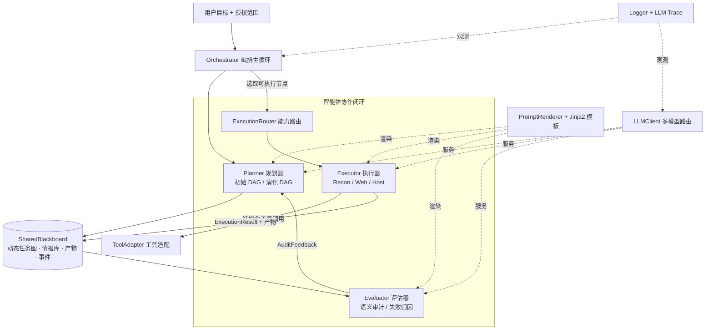

<div align="center">

# 🔱 Divine

**多智能体自动化渗透测试框架**

_以「规划 — 执行 — 评估 — 演化」闭环驱动的授权安全测试编排引擎_

<p>
  
  
  
  
</p>

</div>

---

## ✨ 项目简介

**Divine** 是一个面向**授权安全测试与安全学习**的多智能体编排框架。它不把渗透测试当作一次性的「提问—回答」，而是建模成一个持续演化的智能体协作闭环：

> **规划器**生成动态任务图 → **执行器**用结构化工具采集证据 → **评估器**做语义审计与失败归因 → **规划器**据此演化任务图，直到目标达成或触发终止条件。

所有中间状态——任务图、情报事实、产物证据、审计反馈、事件日志——都沉淀在统一的**共享黑板（SharedBlackboard）**中，使整个推理过程**可追溯、可审计、可复盘**。

> ⚠️ 仅用于**本地靶场、CTF、Docker 环境及书面授权范围内**的安全测试与教学研究，严禁用于未授权目标。

---

## 🎯 核心特性

| 特性 | 说明 |
| --- | --- |
| 🧩 **动态任务图** | 任务以依赖感知的有向图（节点 + 多类型边）表达，支持成功扩展、失败重规划、分支剪枝，而非扁平清单 |
| 🛰️ **结构化执行** | 执行器通过受约束的工具协议（JSON tool-calling）采集证据，每条结论都绑定 `evidence_refs` 产物引用 |
| 🔬 **语义审计闭环** | 评估器对执行结果做 LLM 语义审计，输出任务判定、确认事实、失败归因与规划建议 |
| 🧠 **策略化演化** | 规划器按失败层级选择 `expand / regenerate_node / replan_branch` 三类工程化演化策略 |
| 🗂️ **共享黑板** | 任务图、情报库、产物、执行结果、审计反馈、事件日志集中管理，全程留痕 |
| 🔌 **多模型可插拔** | OpenAI / Anthropic / DeepSeek / DashScope(通义) / Zhipu(智谱) / OpenAI 兼容端点，配置即切换 |
| 🔭 **深度可观测** | 基于 Loguru 的结构化日志 + 全量 LLM 调用追踪（prompt/response 落盘 + 索引） |
| ⚡ **缓存友好上下文** | 提供缓存感知的上下文装配与 token 预算工具，优化长程对话的命中率与成本 |

---

## 🏗️ 架构总览



### 🔁 核心闭环

```python
# Orchestrator.run() —— 同步主循环（简化）
planner.generate_initial_dag(context, blackboard)      # 1. 生成初始任务图

for _ in range(context.max_iterations):                # 硬性兜底
    node = select_executable_node(blackboard)          # 2. 选取依赖就绪节点
    route = router.route(node)                          # 3. 能力路由（recon/web/host）
    result = executors[route.selected_agent].execute(node, blackboard)  # 4. 结构化执行采证
    feedback = evaluator.audit(node, result, blackboard)                 # 5. 语义审计
    plan = planner.evolve_dag(feedback, blackboard)                      # 6. 演化任务图
    if plan.should_terminate or consecutive_failures >= limit:
        break                                           # 7. 终止判定
```

---

## 🧱 核心组件

| 模块 | 职责 | 关键约束 |
| --- | --- | --- |
| `divine.orchestrator` | `Orchestrator` 同步主循环：选点 → 路由 → 执行 → 审计 → 演化 → 终止 | 唯一控制流拥有者，只编排不做智能体推理 |
| `divine.blackboard` | `SharedBlackboard`：动态任务图 + 情报库 + 产物 + 执行结果 + 审计反馈 + 事件日志 | 集中状态、统一 ID 生成、事件留痕 |
| `divine.agents` | `PlannerAgent` / `ExecutorAgent`(+Recon/Web/Host) / `EvaluatorAgent` / `ExecutionRouter` | 输出结构化 JSON，证据绑定，操作受白名单约束 |
| `divine.llm` | `LLMClient` + 多 provider 适配 + 模型目录 + token 计量 | provider 工厂注册，配置驱动 |
| `divine.prompts` | `PromptRenderer` + Jinja2 模板（角色/契约/任务/共享片段） | 模板按智能体角色组织，渲染可追踪 |
| `divine.context` | 缓存感知的上下文装配、token 预算、稳定前缀哈希 | 面向 prompt 缓存与成本优化 |
| `divine.tools` | `ToolAdapter`：纯标准库的安全探测工具集 | 受约束工具协议，结果即 `ToolResult` |
| `divine.logger` | Loguru 结构化日志 + 敏感信息脱敏 + 全量 LLM 调用追踪 | 可观测、可复盘 |

---

## 📁 目录结构

```
divine/
├── __main__.py / cli.py / config.py        # Typer CLI 入口与配置加载
├── orchestrator/        core.py            # Orchestrator 主循环
├── blackboard/          models.py store.py # 数据模型 + SharedBlackboard
├── agents/              planner.py executor.py evaluator.py
├── llm/                 client.py config.py catalog.py types.py errors.py
│   └── providers/       anthropic / openai / dashscope / zhipu / base
├── prompts/             renderer.py + templates/{shared,missions,runtime,agents/*}
├── context/             builder.py cache_policy.py token_budget.py ...
├── tools/               adapter.py
└── logger/              config.py redaction.py trace.py
config/                  llm.example.json  logging.example.json
tests/                   64 用例（编排/规划/执行/评估/LLM/上下文/日志/模板）
```

---

## 🚀 快速开始

### 1. 安装

> 需要 Python **3.11+**

```bash
git clone https://github.com/Hunt3rKun/Divine.git
cd Divine

python -m venv .venv
source .venv/bin/activate

pip install -e ".[dev]"
```

### 2. 配置模型

复制示例并填入你的 API Key（真实配置已被 `.gitignore` 忽略）：

```bash
cp config/llm.example.json config/llm.json
cp config/logging.example.json config/logging.json
```

`config/llm.json` 选择默认 `provider` 并为各 provider 填写凭据：

```jsonc
{
  "provider": "anthropic",                 // 默认使用的 provider
  "generation": { "max_tokens": 4096, "temperature": 0.2 },
  "providers": {
    "anthropic": { "api_key": "sk-ant-...", "model": "claude-opus-4-1-20250805" },
    "openai":    { "api_key": "sk-...",     "model": "gpt-5.5" },
    "zhipu":     { "api_key": "...", "base_url": "https://open.bigmodel.cn/api/paas/v4", "model": "glm-5.1" }
    // deepseek / dashscope / openai_compatible 同理
  }
}
```

### 3. 定义任务

新建 `targets.yaml`（含目标与目标描述，**不放 API Key**）：

```yaml
target: "http://127.0.0.1:8080"          # 或用 targets: [...] 列表
goal: "在授权环境中识别可达服务与 Web 指纹并产出证据。"
scope:
  - "http://127.0.0.1:8080"
max_iterations: 8
max_consecutive_failures: 3
llm_provider: anthropic                   # 可选，覆盖 llm.json 默认
# llm_config / logging_config 可选，默认 config/llm.json、config/logging.json
```

### 4. 运行

```bash
divine engage --config targets.yaml      # 或 python -m divine engage -c targets.yaml
divine version                           # 查看版本
```

运行结束会输出一段 JSON 摘要：终止原因、迭代轮次、节点数、执行/审计次数、确认事实数等。

---

## 🧠 工作流程详解

1. **初始规划**：`PlannerAgent` 依据目标与范围调用 LLM 生成初始任务图（受白名单约束的 `create_node` 操作，单次最多 3 个节点）。
2. **能力路由**：`ExecutionRouter` 按 `task_type` / `assigned_executor` 把节点路由到 `recon_agent` / `web_agent` / `host_agent`；不支持或能力不匹配则阻断并回交规划器。
3. **结构化执行**：执行器进入「动作循环」，每轮产出 `tool_call`（调用 `ToolAdapter` 探测）或 `final_result`（结构化执行结论）。所有产物写入黑板并生成 `evidence_refs`。
4. **语义审计**：`EvaluatorAgent` 审计执行结果，输出 `task_judgement`（状态/完成度/置信度）、`confirmed_facts`、`failure_attribution`（失败层级）与 `planning_feedback`，并校验证据引用有效性。
5. **任务图演化**：`PlannerAgent` 据审计反馈选择策略——成功则 **expand**、执行层失败则 **regenerate_node**、认知/战略/约束/证据不足失败则 **replan_branch**（含分支剪枝）。
6. **终止判定**：命中 `planner_terminated` / `no_executable_nodes` / `max_consecutive_failures` / `max_iterations` 等终止原因之一即收敛。

---

## 🔧 内置探测工具（ToolAdapter）

| 工具 | 用途 |
| --- | --- |
| `tcp_connect_check(host, port)` | TCP 连通性探测 |
| `http_probe(url)` / `https_probe(url)` | HTTP/HTTPS 响应、状态码、响应头、标题采集 |
| `path_probe(base_url, paths)` | 常见路径探测与发现 |
| `host_info()` | 本机平台/系统信息收集 |

> 全部基于 Python 标准库实现，无外部二进制依赖；执行器仅能通过该受约束协议与环境交互。

---

## 🔭 可观测性

- **结构化日志**：默认输出到控制台与 `logs/divine.log`（轮转/保留/压缩可配），关键字段含 `task_id` / `node_id` / `execution_id` / `trace_id`。
- **LLM 全量追踪**：每次模型调用的 prompt、response、token 用量落盘到 `artifacts/llm/`，并在 `logs/llm_traces.jsonl` 建立索引，便于成本核算与回放。
- **脱敏**：日志写出前对敏感数据做哈希/摘要处理。

均由 `config/logging.json` 控制开关与粒度。

---

## ✅ 测试

```bash
pytest -q          # 64 passed
```

覆盖：编排主循环、规划器策略与操作校验、执行器工具循环、评估器审计、LLM 客户端与 token 计量、LLM 追踪、上下文装配、日志、Jinja2 模板渲染与覆盖率。

---

## 🔌 扩展指南

- **新增模型 provider**：在 `divine/llm/providers/` 实现适配器，注册到 `divine/llm/client.py` 的 `PROVIDER_FACTORIES`，并在 `divine/llm/catalog.py` 补充默认模型。
- **新增执行器**：继承 `ExecutorAgent`，声明 `agent_name` / `supported_task_types` 与工具目录，在 `default_capabilities()` 中登记能力。
- **调整提示词**：编辑 `divine/prompts/templates/` 下对应 `.j2` 模板，渲染与覆盖率由测试守护。

---

## 🛡️ 安全与合规

Divine 仅用于**授权范围内**的安全研究与教学：

- 切勿对**未拥有或未获书面授权**的系统运行。
- API Key、真实目标、Cookie、凭据与日志**不得入库**（已由 `.gitignore` 约束）。
- 优先使用本地靶场、CTF、Docker 环境或明确书面范围的评估。
- 高风险动作建议人工复核后再执行。

---

## 🗺️ 路线图

- [ ] 更丰富的执行器工具网关与策略管控
- [ ] 高风险动作的人工审批检查点
- [ ] 漏洞验证与利用链的可复现产物包
- [ ] 报告生成（从黑板证据自动汇总叙述）
- [ ] 任务图可视化与执行回放

---

## 📄 License

[MIT](./LICENSE)

<div align="center">
<sub>Built for authorized security research & learning. Use responsibly. 🔱</sub>
</div>
